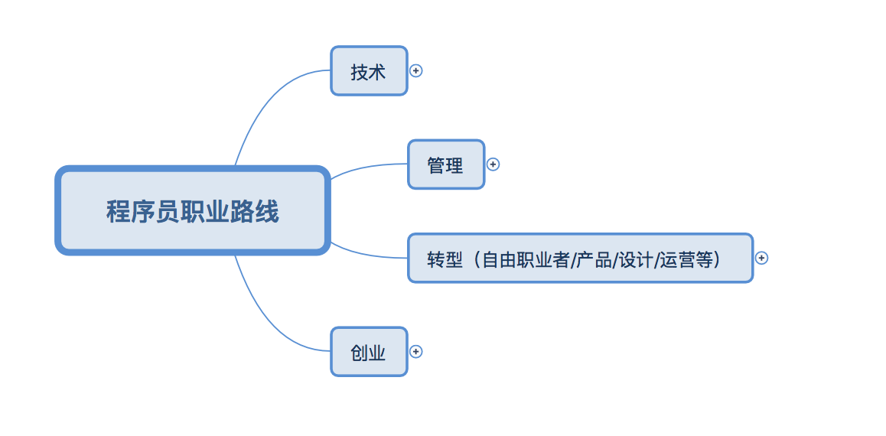
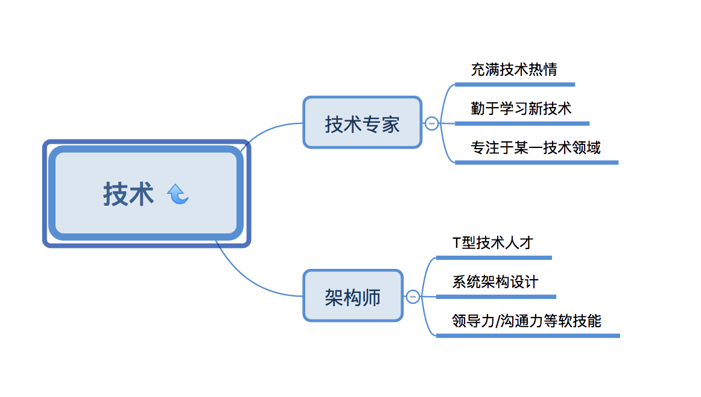
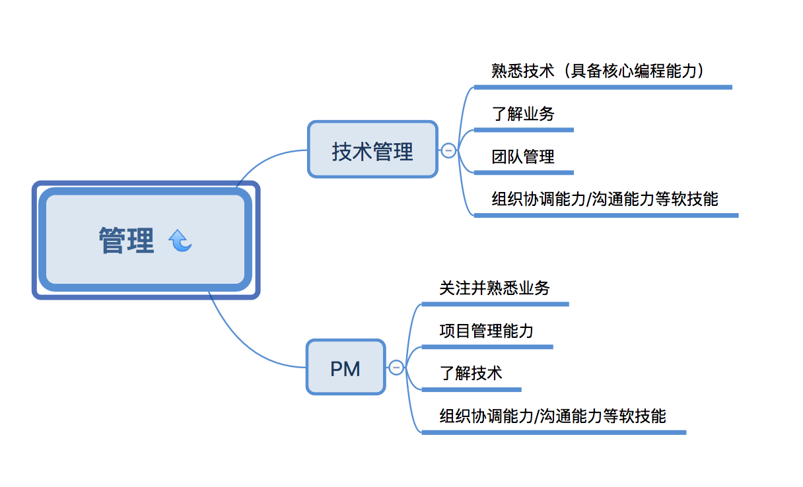
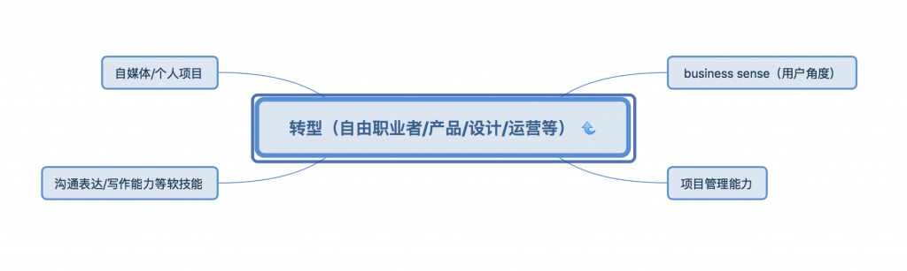
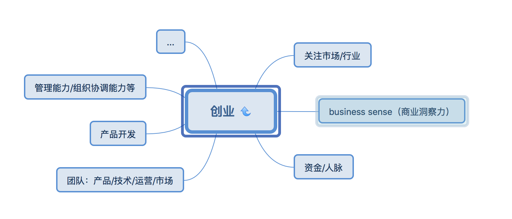
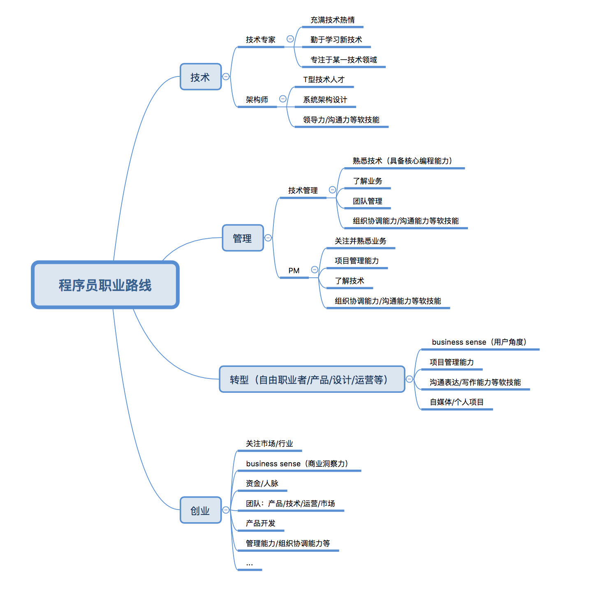

>“华为开始清退35岁以上的程序员”、“35岁的程序员都去哪里了？”、“程序员如何度过中年危机？”。

类似这样的标题我已经记不清看到过多少次了，曾经看到这样的标题，还会好奇的点进去看看内容，久而久之发现这些文章一个套路，文章开篇先贩卖焦虑，然后提出一些解决方案，大都是一些无关痛痒的问题。程序员这个群体已经被打上了“人傻钱多死的快”的标签，但是说到底，程序员也是技术岗位，和传统行业中的生物、化学岗位有着相同的性质。对于程序员经常被黑的问题，我能想到的有两点影响因素：一是近年来互联网行业对传统行业的颠覆离不开技术的支持，程序员作为幕后支持者也逐渐为大家所熟知。二是程序员每天都在使用互联网，自然少不了在网上自黑，然后就形成了这样一种画风...

调侃归调侃，问题还是要解决的。我在大学里学了计算机专业，毕业了入了程序员的坑，为了35岁的时候“不被同龄人抛弃”，秉持“凡事预则立，不预则废”的原则，为了有清晰的职业生涯规划，我调研了程序员的各种职业发展路径。

> 其实35岁不仅仅对程序员来说是一个坎，也是所有职场人士职业生涯中一个关键里程碑。如果25岁研究生毕业，到35岁刚好工作10年，而工作的前10年是一个积累产生量变的过程。
>
>参加工作的前五年，要培养自己的职业素养和工作态度，形成对行业的洞察力，逐渐完善职业技能相关的知识结构，形成稳定的获取信息的能力和渠道。
>
>之后的五到十年，应该形成完善的知识结构和思维方法，不仅仅局限于本职业和本行业相关的知识，对其他职业和其他行业也有一定的了解，看待问题和处理问题形成自己的一套方法论。任何新的技术或者问题，都能迅速透过现象看本质，快速吸收为自身知识体系的一部分。（职业和行业是两个不同的概念，比如说我的职业是程序员，我所在的行业是电商行业，银行和证券公司的程序员职业同样是程序员，但他们所在的行业是金融行业。）

程序员的职业路线总体来说并不复杂，主要可以分为**技术、管理、转行和创业**四条路线，不同职业路线的能力模型不同，所需要眼光和思维模式也不一样。不同路线的共通点是对**程序员技术能力以及沟通协调能力等软技能的要求**。技术能力作为大厦的根基，是程序员一定要打好的基石，程序员作为公司的一部分，工作中必然要和其他人打交道，所以沟通协调能力和表达能力等软技能应该是作为必须具备的通用技能。

## 一、技术路线
技术型路线可以细分为**技术专家**和**架构师**两类，两者在能力模型上都要求**对技术充满热情，能够持续不断的去学习新技术**。区别点在于技术专家要**精通某一技术领域**，偏向理论知识研究；架构师要具备**技术视野、系统性的思维以及领导力等软能力**，偏向工程实践。

在遇到某一技术领域的问题时，技术专家要能够给出相关的解决方案。而架构师着眼于系统性思维，需要对各个技术领域都有涉猎，在系统设计时进行技术选型，同时具有领导力、沟通、管理等软能力。

比方说要做一个电商系统，数据库技术专家需要考虑的是数据库的设计、海量数据存储、数据库并发等数据库方面的问题，而架构师要考虑前端、后端、数据库、服务器等方面的技术选型和设计，思考系统的可用性、扩展性、安全性，同时要思考导购、交易、订单、供应链、营销等子系统的功能设计，以及各个子系统之间的联系。

##二、管理路线
程序员工作时间长是众所皆知，很多人说在一线技术岗位不适合做太久，做几年就转成管理岗。管理岗也是有对应的能力模型的，能力达到了要求，带团队是顺其自然的事情。一个团队的负责人对整个团队的影响非常大，决定了整个团队整体的工作氛围和发展方向，“兵熊熊一个，将熊熊一窝”，这话一点不假。

程序员的管理路线可以分为技术管理和项目管理（Project Manager），两条路线都要求具备管理能力，也有着不同的侧重点。技术管理者要带领团队保质保量完成业务需求，首先是要对业务有一定的了解，同时要能够具备团队管理能力，进行工作量的评估，分配任务，提升团队成员实力。技术管理侧重于以事情为中心，项目经理侧重于以人为中心。项目经理要协调多方资源保证项目的交付，这就需要组织协调能力，同时要能够具备项目管理能力，能够理清项目干系人，分解项目职责，考虑项目风险，使各个团队资源达到一个平衡点。

## 三、转行
一般在互联网公司的一个业务部门，有销售、技术、产品、设计、运营等岗位。技术岗可以转型做销售、产品、运营、设计，甚至成立工作室去做一些个人项目。拿产品岗举例来说，程序员转型做产品的优势就是具有技术思维，懂得如何通过技术去实现产品需求，但是也有许多劣势。

**商业思维**：技术开发只需要完成产品经理的需求，很少去考虑实现需求的目的，不用思考产品背后的业务逻辑，公司是如何通过这个产品去盈利的。这是技术转产品需要锻炼的一个能力：培养自己的商业思维，对所在行业有清晰的认识，理解产品的商业目标，站在用户的角度去思考用户需求。

**沟通表达能力**：程序员给人的印象都是木纳的，因为程序员主要和机器打交道，机器比人简单多了，按照逻辑流程执行代码，不会出现千变万化的结果，就像一个纯函数一样。但是产品岗位需要和技术、运营、设计去打交道，让各个岗位的同学理解你的产品需求，产品上线之后要给运营或者客服进行培训，这都需要良好的语言组织能力和表达能力。

**写作能力**：技术开发的主要工作是写代码，也就在写注释和产品说明书的时候需要写一些文档。如果让技术人员去针对产品去写商业需求文档、市场需求文档、产品需求文档，可能还有一定难度，所以文档写作能力也是很重要的一个点。

技术岗也可以转行做其他岗位，不同的岗位对应的不同的Job Model，想好要发展的方向，针对性的去培养自己的能力，转行也不是一件难事。

技术岗也可以做一个自由职业者，承接一些个人项目，或者做出在业界知名的项目，做技术讲师和技术咨询也是可选择的方向。自由职业者需要良好的技术能力作为功底，同时要打造业界知名度，梳理个人品牌形象，思考自由职业的变现方式。

## 四、创业
创业对于程序员来说，也是一条可选择的职业规划路线，毕竟人人都有出任CEO的理想。程序员创业不一定要做CEO，可以做技术合伙人（CTO）。创业对一个人的综合素质要求比较高，首先技术视野和架构能力是基础要求，要具有商业意识和分析市场的能力，能够洞察市场与用户需求，通过产品与技术创新实现公司商业战略，为用户创造价值。其次要有清晰的自我认识，了解各个岗位的职责，具备管理能力，能够打造一支优秀的团队。创业还需要具备很多方面的软实力，此处省略一万字......

## 五、总结
这四条路线是我对程序员常见的职业发展路线的思考与总结，可选择的路很多，最重要还是要看合不合适自己。有的人痴迷技术，不愿意做管理，选择走技术型路线。阿里合伙人多隆，淘宝早期的产品和淘宝文件系统TFS都是他一个人开发的，现在是公司的总裁，但是他不爱带团队，现在依然奋斗在一线技术岗位，依然在写代码（可能这就是情怀吧...）。有的人拥有一腔热血，为了实现理想抱负选择创业，比尔盖茨、扎克伯格、雷军、马化腾、李彦宏，都是程序员创业的成功案例（当然失败的数不胜数...）。每个人的性格特征不同，对工作的期待也不同，可以思考自身的特点，建立起自身与他人的差异以及自身的独特标签，结合职业目标的能力模型，进行一次SWOT分析，选择最适合自己的路，持续不断的提高核心竞争力，加强自己的不可替代性。

职业规划给整个职业生涯指明一个方向，确定了前进的方向后，在实际工作中再通过实践不断去调整，寻找合适自己的发展道路。没有清晰的目标，往哪里走都是流浪，早日想清楚自己真正需要的是什么，树立清晰的职业规划，这样才不至于在“中年危机”来临时感到焦虑。互联网打破了许多信息不对称的壁垒，但是爆炸性的知识量也容易让人失去判断能力，要学会锻炼自己的认知和判断能力，对信息进行搜集、筛选和利用，按照自己的节奏去发展，不要被信息操纵，毕竟被操纵的都是平庸之辈。