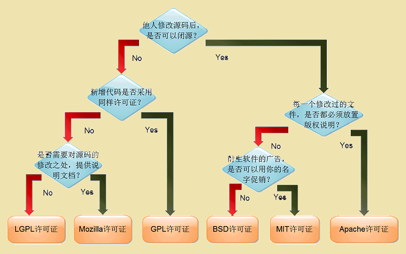

## 如何写好一个README？

### 一、目的
编写一个项目的README文件就像写一本书的序言一样，一个好的项目不仅本身需要具有一定价值，同时应该有一份高质量的文档。方便用户快速了解项目解决的问题、项目开发环境、项目开发语言等，让用户快速抉择是否需要深入了解这个项目，也减少了用户的使用成本。

### 二、组成部分
看过github上的一些README，总结一下，主要有以下几个核心部分组成：

* 项目介绍
* 项目使用方法
* API文档
* 作者联系信息

更完善的模块如下：

* 国际化
* 项目介绍
* 项目使用方法
* API文档
* 版本变化
* 待完善功能
* 常见问题汇总
* 作者联系信息
* 贡献者/贡献组织
* 版权信息

### 三、模块介绍
#### 3.1 国际化
Github是面向全球的“交友网站”，所以可能会有国外的开发者需要使用你的项目，这时候就需要一份双语的文档了。

#### 3.2 项目介绍
这部分是整个README中比较核心的部分，主要从几个方面入手去写这部分内容：

* 项目名称及logo
* 项目用途
* 项目开发语言
* 项目特点
* 项目架构
* 项目最新版本信息
* 项目目前有哪些用户
* Demo演示地址或者官网

当然，上面所列举的因素不一定是都需要去描述的，也可以放在其他部分去描述。

#### 3.3 项目使用方法
通过这部分内容，用户能够快速了解如何使用你的项目。  
首先应该告诉用户**如何获取以及初始化你的项目**，然后告诉用户**运行、编译、部署、调试**的操作流程。

#### 3.4 API文档
当用户使用你的项目出现问题时，就会需要查阅你的API文档，所以API文档也要尽可能友好。  
应该表达清楚每个API的作用、入参出参、返回值等。

#### 3.5 版本变化
可以写一份CHANGELOG文档，记录各个版本的修改内容，方便用户去选择使用哪个版本。

#### 3.6 待完善功能
这部分可以让用户了解到你的开发计划，有哪些新功能已经在你的开发计划中，也让用户明确你的项目是在不断维护更新的。

#### 3.7 常见问题汇总
记录一些常见的问题。

#### 3.8 作者联系信息
方便联系作者

#### 3.9 贡献者/贡献组织
将项目贡献者和贡献组织公示出来，可以吸引到更多开发者参与到我们的开源项目中。

#### 3.10 版权信息
维护作者利益。  
最流行的有六种：GPL、BSD、MIT、Mozilla、Apache、LGPL。

### 四、参考
* [README语法](http://younghz.github.io/Markdown/)
* [webpack README](https://github.com/webpack/webpack)
* [ant-design README](https://github.com/ant-design/ant-design)
