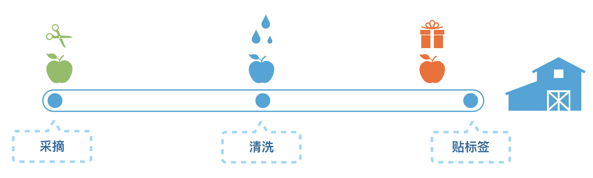

## 面向切面编程

用过express、koa或者redux的同学应该都知道它们都有“中间件”这样一个概念。
设计思想都是面向切面编程的思想，业务代码进行解耦。

面向切面编程(Aspect Oriented Programming，也叫面向方面编程)是一种非侵入式扩充对象、方法和函数行为的技术。

核心思想是通过对方法的拦截，在预编译或运行时进行动态代理，实现在方法被调用时可以以对业务代码无侵入的方式添加添加功能。

比如像日志、事务等这些功能，和核心业务逻辑没有直接关联，通过切面的方式和核心业务逻辑进行剥离，让业务同学只需关心业务逻辑的开发，当需要用到这些功能的时候就把切面插拔到业务流程的某些点上，做到了切面和业务的分离。

如果需要在一些方法执行前添加统一的处理（如登录校验等），在Spring中，可以声明一个切面拦截指定方法。Spring切面实际上使用了JdkDynamic或Cglib的代理机制。

我们举个例子，来帮助理解面向切面编程的使用场景。

农场的水果包装流水线一开始只有 采摘 - 清洗 - 贴标签



为了提高销量，想加上两道工序 分类 和 包装 但又不能干扰原有的流程，同时如果没增加收益可以随时撤销新增工序。


最后在流水线的中的空隙插上两个工人去处理，形成采摘 - 分类 - 清洗 - 包装 - 贴标签 的新流程，而且工人可以随时撤回。

回到什么是AOP？就是在现有代码程序中，在程序生命周期或者横向流程中 加入/减去 一个或多个功能，不影响原有功能。

我们通过一个实际问题来分析AOP的好处。

现在有一个类`Foo`，类中包含了方法`doSomething`，我想在每次方法`doSomething`执行前和执行后打印一段日志，想实现的效果如下：

``` javascript
class Foo {
  doSomething(a, b) {
    let result;

    // dosomething

    return result
  }
}

const foo = new Foo()
foo.doSomething(1, 2)

// before add, value: 1, 2
// after add, result: result
``` 

最简单粗暴的方法，就是重写`add`方法

``` javascript
cclass Foo {
  doSomething(a, b) {
    console.log(`before add, value: ${a}, ${b}`)
    let result;

    // dosomething

    console.log(`after add, result: ${result}`)
    return result
  }
}

const foo = new Foo()
foo.doSomething(1, 2)

// before add, value: 1, 2
// after add, result: result
```

但是如果我多次调用add方法，每次都需要手动写代码打日志，效率很低。


### References
* [koa-compose源代码](https://github.com/koajs/compose/blob/master/index.js)
* [redux中compose的实现](https://github.com/reduxjs/redux/blob/master/src/compose.js)
* [Koa.js 的AOP设计](https://chenshenhai.github.io/koajs-design-note/note/chapter02/01.html)
* [编写可维护代码之“中间件模式”](https://zhuanlan.zhihu.com/p/26063036)