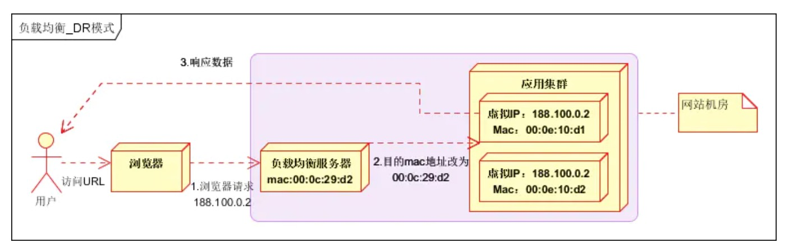
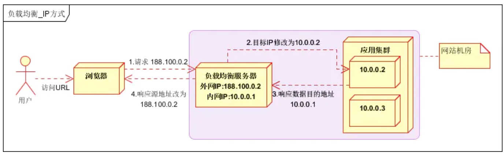
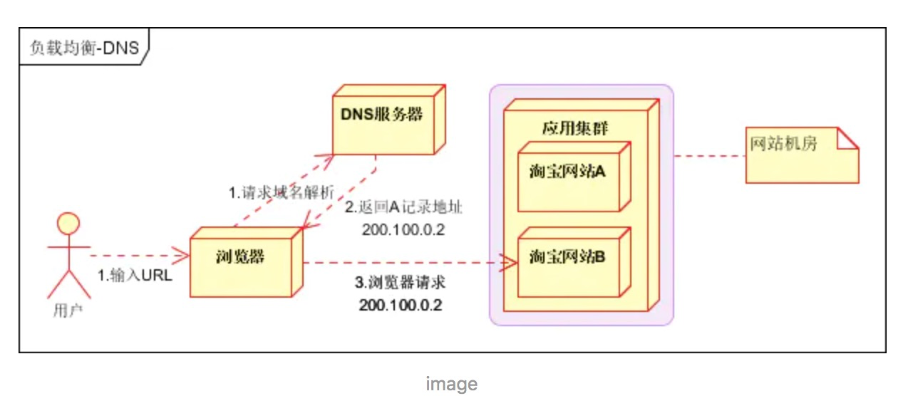

## 负载均衡

### 介绍
#### 场景
* 并发请求转发给多个节点处理
* 单个繁重任务转发给多个节点处理

#### 目的
通过调度集群，达到最佳化资源使用，最大化吞吐率，最小化响应时间，避免单点过载

### 负载均衡分类
根绝OSI七层模型分类。

#### 数据链路层负载均衡
数据分发时，不修改ip地址，只修改目标mac地址。

真实物理服务器集群所有机器VIP和负载均衡服务器VIP地址一致，不修改数据包的源地址和目标地址即可进行数据分发。

不需要经过负载均衡服务器进行地址转换，可将响应数据包直接返回给用户浏览器，避免负载均衡服务器网卡带宽成为瓶颈。

**优点**
* 负载均衡服务器只负责转发请求，响应直接返回给客户端

**缺点**
* 配置负载

#### 网络层负载均衡
用户请求数据包，到达负载均衡服务器后，负载均衡服务器根据负载均衡算法得到一台真实服务器地址，然后将请求目的地址修改为真实服务器ip地址，不需要经过用户进程处理。

真实服务器处理完成后，响应数据包回到负载均衡服务器，负载均衡服务器，再将数据包源地址修改为自身的ip地址，发送给用户浏览器。

**缺点**
* 流量请求进出都要经过负载均衡服务器

#### 传输层负载均衡
基于IP和端口号做负载均衡，对流量进行NAT处理
案例：LVS、F5

#### 应用层负载均衡
在传输层负载均衡的基础上，考虑应用层的特征，例如HTTP请求的URL、浏览器类别、语言等特征，进行负载均衡处理。

### 负载均衡方案
#### 基于DNS的负载均衡
利用域名解析实现负载均衡，在DNS服务器，配置多个A记录，这些A记录对应的服务器构成集群

**优点**
* 简单易用
* 提高性能：支持基于地址的域名解析，解析到距离用户最近的服务器地址

**缺点**
* 可用性差：DNS多级缓存
* 扩展性差
* 维护性差：也不能反映服务器的当前运行状态；支持的算法少；不能区分服务器的差异

#### 基于硬件的负载均衡

**问题**
* 硬件成本高

#### 基于软件的负载均衡

### 负载均衡算法
#### 轮询（Round Robin）
轮流转发请求
具体实现方式
* 顺序轮询
* 随机轮询
* 权重轮询

#### 负载度策略
评估后端服务器的负载压力，转发流量

#### 响应策略
转发到响应最快的服务器

#### 哈希策略
对请求中的某个信息进行哈希计算，相同的请求就被转发到同一个服务器上
优点
• 有利于处理缓存
缺点
• 单点故障时，会导致客户端无法正常使用

### 参考
* [一篇读懂分布式架构下的负载均衡技术：分类、原理、算法、常见方案等](https://www.cnblogs.com/imstudy/p/10790228.html)
* [大型网站架构系列：负载均衡详解](https://www.jianshu.com/p/215b5575107c)
* [LVS原理篇：LVS简介、结构、四种模式、十种算法](https://blog.csdn.net/lcl_xiaowugui/article/details/81701949)